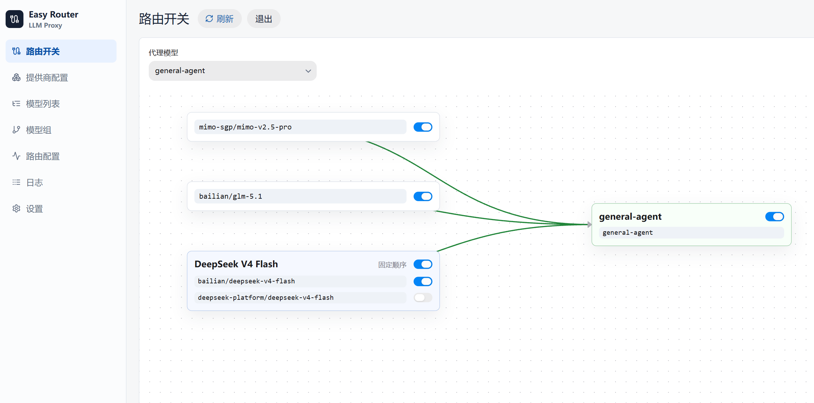

# Easy Router

Easy Router 是一个本地大模型代理服务。客户端只需要调用一个虚拟模型名，Easy Router 会按后台配置的路由，把请求转发到真实的上游模型。

它适合这些场景：

- 给多个 OpenAI 兼容服务做统一入口。
- 用一个模型名在多个真实模型之间切换。
- 在模型失败时按规则尝试备用模型。
- 在本地管理提供商、模型、模型组、路由和代理访问密钥。

## 演示截图



## 功能

- 支持 OpenAI 兼容提供商。
- 支持 `/v1/models`、`/v1/chat/completions`、`/v1/responses`。
- 内部模型 ID 固定为 `provider_id/original_model_id`。
- 支持模型组：固定顺序、随机、轮询。
- 支持路由模型多层切换和失败后备用。
- 支持流式响应。
- 管理后台使用 React、HeroUI v3 和 React Flow。
- SQLite 使用纯 Go 驱动，不需要单独安装 SQLite 服务。
- 提供商 API Key 和代理访问密钥使用 `EASY_ROUTER_SECRET_KEY` 加密保存。

## 技术栈

- 后端：Go 1.22+
- 数据库：SQLite（`modernc.org/sqlite`）
- 前端：React、TypeScript、Vite、HeroUI v3、React Flow
- 包管理：npm

## 配置

可以在项目根目录新建 `.env`：

```env
EASY_ROUTER_SECRET_KEY=replace-with-a-long-random-string
EASY_ROUTER_ADDR=127.0.0.1:2778
EASY_ROUTER_DB=./data/easy-router.db
```

配置说明：

- `EASY_ROUTER_SECRET_KEY`：必填。用于加密保存密钥。
- `EASY_ROUTER_ADDR`：可选。服务监听地址，默认 `127.0.0.1:2778`。
- `EASY_ROUTER_DB`：可选。SQLite 数据库路径，默认 `./data/easy-router.db`。

系统环境变量优先级更高，会覆盖 `.env` 中的同名配置。

不要提交真实密钥、本地数据库和运行日志。

## 开发运行

下面的命令都从仓库根目录执行。

安装前端依赖：

```sh
npm run web:install
```

构建前端静态文件：

```sh
npm run web:build
```

启动后端：

```sh
go run ./cmd/easy-router
```

首次启动时，控制台会显示管理员账号和密码。登录后台后请尽快修改密码。

默认访问地址：

```text
http://127.0.0.1:2778
```

如果修改了 `EASY_ROUTER_ADDR`，请使用你配置的地址。

## 前端开发

启动 Vite 开发服务：

```sh
npm run web:dev
```

如果改动需要被 Go 后端嵌入，请重新运行：

```sh
npm run web:build
```

构建产物会写入：

```text
cmd/easy-router/web/dist
```

## 测试

运行 Go 测试：

```sh
npm test
```

也可以直接运行：

```sh
go test ./...
```

## 构建

构建发布二进制前，先构建前端：

```sh
npm run web:build
```

然后设置 Go 的目标平台变量，再构建后端：

```sh
go build -o <output-file> ./cmd/easy-router
```

推荐至少构建这两个目标：

| 目标 | Go 环境变量 | 建议输出文件 |
| --- | --- | --- |
| Windows x64 | `GOOS=windows`, `GOARCH=amd64` | `bin/easy-router-windows-amd64.exe` |
| Linux aarch64 | `GOOS=linux`, `GOARCH=arm64` | `bin/easy-router-linux-arm64` |

不同 shell 设置环境变量的写法不同。请按当前环境设置 `GOOS` 和 `GOARCH`，不要假设开发设备就是目标平台。

## 客户端调用

先在后台“设置”里创建代理访问密钥，然后调用接口。

查看模型列表：

```sh
curl http://127.0.0.1:2778/v1/models \
  -H "Authorization: Bearer <proxy_key>"
```

Chat Completions 示例：

```sh
curl http://127.0.0.1:2778/v1/chat/completions \
  -H "Authorization: Bearer <proxy_key>" \
  -H "Content-Type: application/json" \
  -d '{"model":"coder-fast","messages":[{"role":"user","content":"hello"}]}'
```

Responses 示例：

```sh
curl http://127.0.0.1:2778/v1/responses \
  -H "Authorization: Bearer <proxy_key>" \
  -H "Content-Type: application/json" \
  -d '{"model":"coder-fast","input":"hello"}'
```

如果修改了监听地址，请把示例里的 `127.0.0.1:2778` 换成你的地址。

## 目录

- `cmd/easy-router`：后端入口和嵌入的前端静态文件。
- `cmd/easy-router/web`：React 管理后台。
- `cmd/easy-router/web/dist`：前端构建产物，会被 Go 二进制嵌入。
- `internal/admin`：管理后台 API。
- `internal/config`：配置和 `.env` 加载。
- `internal/proxy`：OpenAI 兼容代理、路由和失败后备用。
- `internal/store`：SQLite 表结构、迁移和数据访问。
- `data`：本地数据库默认目录。
- `bin`：本地构建输出目录。

## 开源协议

本项目使用 GNU Affero General Public License v3.0（AGPL-3.0）开源，详见 [LICENSE](LICENSE)。
